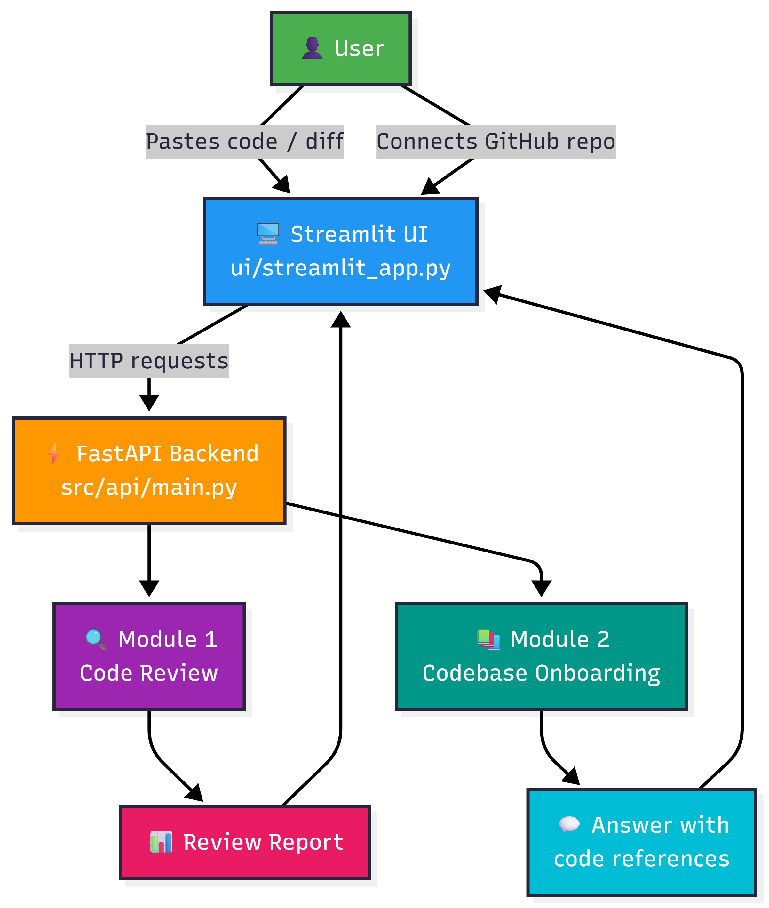
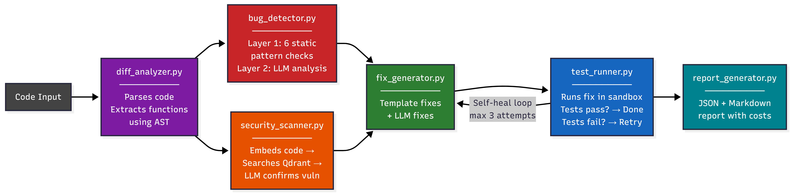
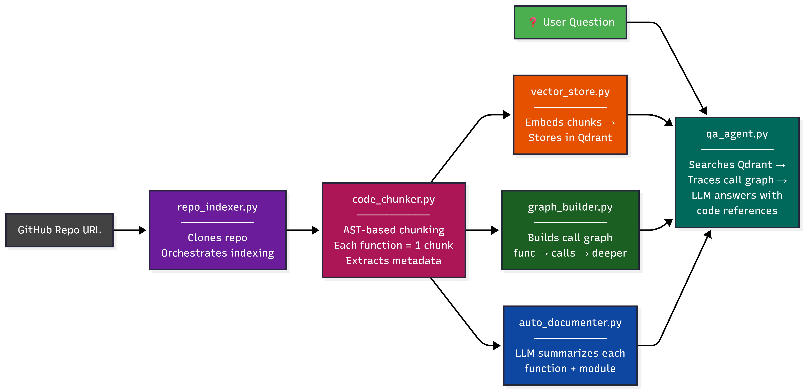
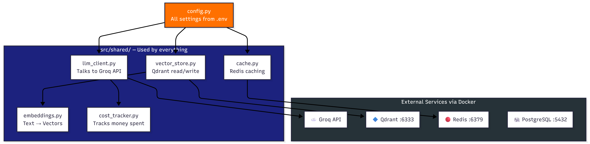
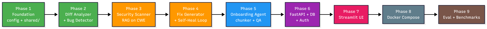

# CodeSentinel AI

**AI-powered Developer Intelligence Platform** -- Automated code review with self-healing fixes and codebase onboarding for new team members.

> Built with Groq LLM, RAG on CWE vulnerability database, Qdrant vector search, Redis caching, FastAPI, and Streamlit.

---

## System Overview



CodeSentinel AI is a two-module platform:

- **Module 1 -- Code Review Agent**: Submit code or a diff. The system detects bugs using a two-layer approach (static patterns + LLM deep analysis), scans for security vulnerabilities using RAG on the CWE database, generates auto-fixes, tests them in a sandbox, and self-heals failed fixes with up to 3 retry attempts.

- **Module 2 -- Codebase Onboarding Agent**: Connect a GitHub repository. The system indexes it using AST-based code chunking, builds a function call graph, auto-generates documentation using LLM, and enables new team members to ask natural language questions with answers referencing exact files and line numbers.

---

## Architecture

### Code Review Pipeline



The review pipeline has 6 stages:

| Stage | File | What It Does |
|-------|------|-------------|
| 1. Parse | `diff_analyzer.py` | AST-based function extraction from code |
| 2. Detect | `bug_detector.py` | Layer 1: 6 static pattern checks (free, instant) + Layer 2: LLM deep analysis |
| 3. Scan | `security_scanner.py` | RAG search on CWE database + LLM confirmation |
| 4. Fix | `fix_generator.py` | Template fixes for common bugs + LLM-generated fixes |
| 5. Test | `test_runner.py` | Sandbox execution + self-healing retry loop (max 3 attempts) |
| 6. Report | `report_generator.py` | JSON + Markdown report with severity, cost, and metrics |

### Codebase Onboarding Pipeline



| Stage | File | What It Does |
|-------|------|-------------|
| 1. Index | `repo_indexer.py` | Clones the GitHub repo and orchestrates indexing |
| 2. Chunk | `code_chunker.py` | AST-based chunking (each function/class = 1 chunk with metadata) |
| 3. Graph | `graph_builder.py` | Builds function call graph (who calls who) |
| 4. Document | `auto_documenter.py` | LLM generates 1-2 sentence summaries per chunk |
| 5. Store | `vector_store.py` | Embeds chunks and stores in Qdrant |
| 6. Answer | `qa_agent.py` | Searches Qdrant + traces call graph + LLM answers with code references |

### Shared Infrastructure



### Build Phases



---

## Tech Stack

| Component | Technology | Why |
|-----------|-----------|-----|
| LLM | Groq API (Llama 3.3 70B) | Fastest inference for LLMs (free tier available) |
| Embeddings | Sentence Transformers (BGE-small-en) | Lightweight, 384-dim vectors, runs locally |
| Vector DB | Qdrant | Dense vector search for RAG |
| Cache | Redis | Cache expensive LLM calls |
| Backend | FastAPI | Async Python API with auto-generated docs |
| Frontend | Streamlit | Rapid prototyping for data/ML apps |
| Deployment | Docker Compose | Single command to run all 5 services |

---

## Bug Detection: Two-Layer Approach

### Layer 1 -- Static Patterns (Free, Instant)

6 detectors that use regex + AST pattern matching. No LLM cost.

| Detector | What It Catches | CWE |
|----------|----------------|-----|
| SQL Injection | f-string/format in SQL queries | CWE-89 |
| Hardcoded Secrets | passwords, API keys, tokens in source code | CWE-798 |
| Command Injection | `os.system()`, `subprocess` with user input | CWE-78 |
| Code Injection | `eval()`, `exec()` on untrusted input | CWE-94 |
| Bare Except | `except:` without specific exception type | CWE-396 |
| Resource Leak | `open()` without context manager | CWE-404 |

### Layer 2 -- LLM Deep Analysis

For complex bugs that regex can't catch:
- Logic errors (wrong algorithm, off-by-one)
- Race conditions
- Business logic flaws
- Missing edge case handling

---

## Benchmark Results

```
============================================================
CODESENTINEL AI -- BENCHMARK
============================================================

[1/10]  SQL Injection via f-string         PASS
[2/10]  Hardcoded password                 PASS
[3/10]  Bare except with pass              PASS
[4/10]  eval() on user input               PASS
[5/10]  os.system with user input          PASS
[6/10]  File opened without context mgr    PASS
[7/10]  Mutable default argument           PASS
[8/10]  Clean code (no bugs)               PASS
[9/10]  Multiple vulnerabilities           PASS
[10/10] Pickle deserialization             PASS

============================================================
OVERALL RESULTS (Static Patterns Only)
============================================================
  True Positives:  9
  False Positives: 0
  False Negatives: 0
  Precision:       100.0%
  Recall:          100.0%
  F1 Score:        100.0%
============================================================

  10/10 test cases fully passed
```

---

## Quick Start

### Prerequisites

- Python 3.11+
- Docker Desktop (for Qdrant and Redis)
- Groq API key (free at https://console.groq.com)

### 1. Clone and Install

```bash
git clone https://github.com/Yashraj0906/codesentinel-ai.git
cd codesentinel-ai

python -m venv venv
# Windows:
venv\Scripts\activate
# macOS/Linux:
source venv/bin/activate

pip install -e ".[dev]"
```

### 2. Start Infrastructure

```bash
docker run -d -p 6333:6333 --name qdrant qdrant/qdrant
docker run -d -p 6379:6379 --name redis redis:7-alpine
```

### 3. Configure Environment

```bash
cp .env.example .env
```

Edit `.env` and add your Groq API key:
```
GROQ_API_KEY=your_groq_api_key_here
```

### 4. Seed the Vulnerability Database

```bash
python -m scripts.seed_cve_data
```

This loads 10 CWE vulnerability patterns into Qdrant for the security scanner.

### 5. Start the Application

**Terminal 1** (API backend):
```bash
uvicorn src.api.main:app --port 8000 --reload
```

**Terminal 2** (Streamlit frontend):
```bash
streamlit run ui/streamlit_app.py
```

### 6. Open the App

- Frontend: http://localhost:8501
- API Docs: http://localhost:8000/docs
- Health Check: http://localhost:8000/health

### Alternative: Docker Compose (one command)

```bash
docker-compose up
```

---

## API Endpoints

| Method | Endpoint | Description |
|--------|----------|-------------|
| GET | `/health` | Health check |
| POST | `/review/analyze` | Submit code for review |
| POST | `/onboard/index` | Index a GitHub repository |
| POST | `/onboard/ask` | Ask a question about indexed code |

### Example: Code Review

```bash
curl -X POST http://localhost:8000/review/analyze \
  -H "Content-Type: application/json" \
  -d '{"code": "def login(user):\n    query = f\"SELECT * FROM users WHERE name = {user}\"\n    return eval(query)"}'
```

---

## Project Structure

```
codesentinel-ai/
|
|-- src/
|   |-- config.py                    # All settings from .env
|   |
|   |-- shared/                      # Reusable infrastructure
|   |   |-- llm_client.py            # Groq API wrapper with retry + cost tracking
|   |   |-- embeddings.py            # Sentence Transformers (text to vectors)
|   |   |-- vector_store.py          # Qdrant CRUD operations
|   |   |-- cache.py                 # Redis caching layer
|   |   |-- cost_tracker.py          # Token usage and cost tracking
|   |
|   |-- review/                      # Module 1: Code Review Agent
|   |   |-- __init__.py              # CodeReviewPipeline (orchestrator)
|   |   |-- diff_analyzer.py         # AST-based code parsing
|   |   |-- bug_detector.py          # 6 static patterns + LLM analysis
|   |   |-- security_scanner.py      # RAG on CWE database
|   |   |-- fix_generator.py         # Auto-fix generation
|   |   |-- test_runner.py           # Sandbox testing + self-heal loop
|   |   |-- report_generator.py      # JSON + Markdown reports
|   |
|   |-- onboard/                     # Module 2: Codebase Onboarding Agent
|   |   |-- code_chunker.py          # AST-based chunking
|   |   |-- graph_builder.py         # Function call graph
|   |   |-- auto_documenter.py       # LLM-generated summaries
|   |   |-- repo_indexer.py          # Clone + index orchestrator
|   |   |-- qa_agent.py              # RAG Q&A with code references
|   |
|   |-- api/                         # FastAPI backend
|   |   |-- main.py                  # App entry point with CORS
|   |   |-- routes/
|   |       |-- review.py            # POST /review/analyze
|   |       |-- onboard.py           # POST /onboard/index, /onboard/ask
|   |       |-- health.py            # GET /health
|   |
|   |-- db/                          # Database layer
|   |   |-- database.py              # Async SQLAlchemy connection
|   |   |-- models.py                # Users, Reviews, ChatHistory tables
|   |
|   |-- evaluation/                  # Benchmarking
|       |-- metrics.py               # Precision, Recall, F1 calculation
|       |-- benchmark.py             # 10 test cases with ground truth
|
|-- ui/
|   |-- streamlit_app.py             # Premium Streamlit frontend
|
|-- scripts/
|   |-- seed_cve_data.py             # Load CWE data into Qdrant
|   |-- test_pipeline.py             # End-to-end pipeline test
|
|-- images/                          # Architecture diagrams
|-- docs/                            # Documentation
|-- docker-compose.yml               # Run all services
|-- Dockerfile                       # Container build
|-- pyproject.toml                   # Python dependencies
|-- .env.example                     # Environment template
```

---

## How It Works (Technical Deep Dive)

### Self-Healing Fix Loop

When a fix is generated, it is tested in a sandboxed subprocess:

```
Fix generated by LLM
        |
        v
  Run in sandbox (subprocess, 30s timeout)
        |
   Tests pass? ----YES----> Mark as auto-fixed
        |
       NO
        |
        v
  Send error feedback to LLM
  "Your fix caused: TypeError on line 5"
        |
        v
  LLM generates revised fix
        |
        v
  Retry (max 3 attempts)
```

### RAG Security Scanning

```
User's code
    |
    v
Embed with BGE-small (384-dim vector)
    |
    v
Search Qdrant "cve_vulnerabilities" collection
    |
    v
Top-5 similar CWE patterns returned
    |
    v
LLM confirms: "Is this actually vulnerable?"
    |
    v
Only confirmed vulnerabilities reported
```

### Codebase Q&A (RAG)

```
User question: "How does authentication work?"
    |
    v
Embed question with BGE-small
    |
    v
Search Qdrant "codebase_chunks" collection (top-10)
    |
    v
Retrieved chunks include:
  - Code text
  - File path + line numbers
  - Function summaries
  - Call graph (who calls who)
    |
    v
LLM generates answer with specific file/line references
```

---

## Future Enhancements

- Multi-language support using `tree-sitter` universal parser
- GitHub PR webhook integration for automated reviews
- VS Code extension for inline bug detection
- Full CWE database (1000+ entries) for security scanning
- User authentication and review history with PostgreSQL
- Deployment to cloud (AWS/Railway/Render)

---

## Run Benchmarks

```bash
python -m src.evaluation.benchmark
```

---

## License

MIT

---

Built by [Yashraj](https://github.com/Yashraj0906)
