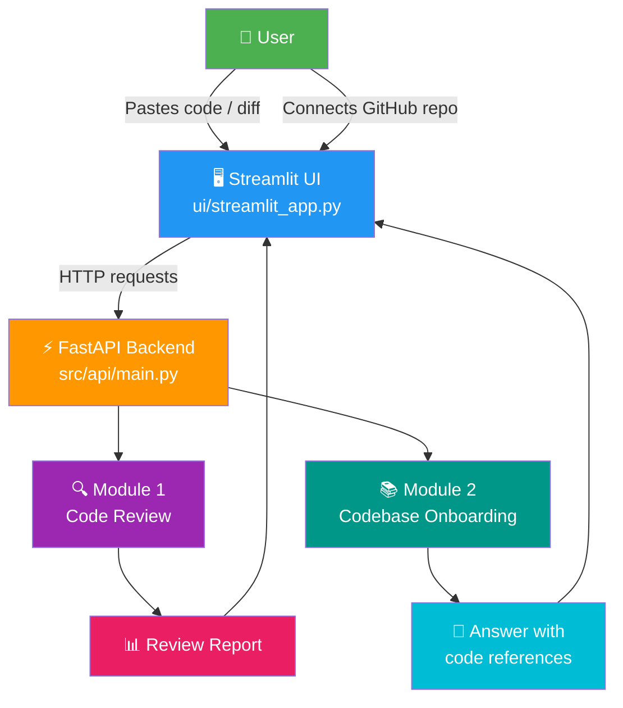
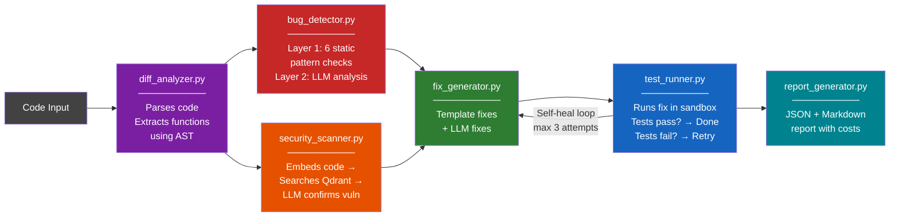
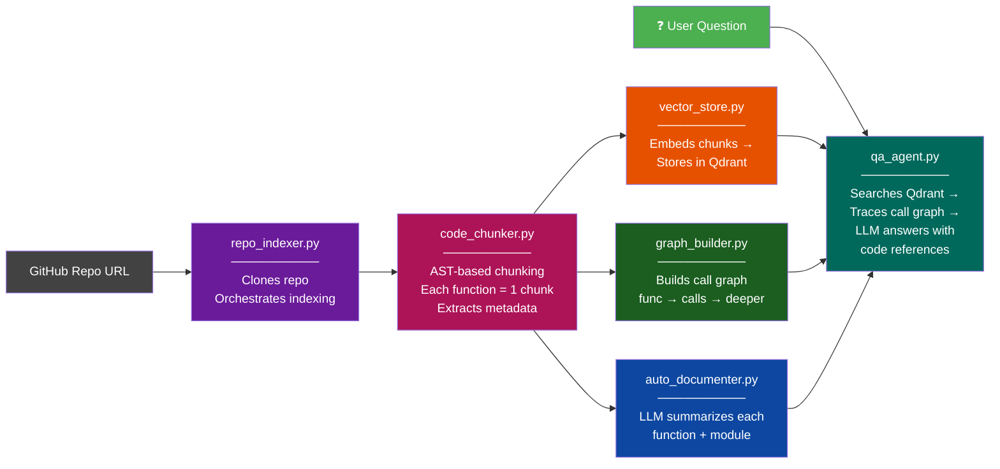
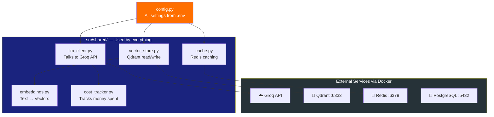

# CodeSentinel AI — Architecture Overview

## The Big Picture



---

## Module 1: Code Review Pipeline



---

## Module 2: Codebase Onboarding Pipeline



---

## Shared Infrastructure (used by both modules)



---

## Complete File Map

```
📁 codesentinel-ai/
│
├── 📄 .env                    ← Your secrets (API keys)
├── 📄 pyproject.toml          ← Dependencies
├── 📄 docker-compose.yml      ← One command to run everything
├── 📄 Dockerfile              ← Package the app
│
├── 📁 src/
│   ├── 📄 config.py           ← All settings loaded from .env
│   │
│   ├── 📁 shared/             ← Used by BOTH modules
│   │   ├── 📄 llm_client.py       → Groq API wrapper + retry + cost
│   │   ├── 📄 embeddings.py       → Text → 384-dim vector
│   │   ├── 📄 vector_store.py     → Qdrant CRUD operations
│   │   ├── 📄 cache.py            → Redis get/set with TTL
│   │   └── 📄 cost_tracker.py     → Tracks tokens + cost + latency
│   │
│   ├── 📁 review/             ← MODULE 1: Code Review
│   │   ├── 📄 diff_analyzer.py    → Parses code, extracts functions (AST)
│   │   ├── 📄 bug_detector.py     → 6 static patterns + LLM analysis
│   │   ├── 📄 security_scanner.py → RAG on CWE vulnerability database
│   │   ├── 📄 fix_generator.py    → Generates code fixes
│   │   ├── 📄 test_runner.py      → Runs tests + self-healing loop
│   │   └── 📄 report_generator.py → Builds JSON + Markdown report
│   │
│   ├── 📁 onboard/            ← MODULE 2: Codebase Onboarding
│   │   ├── 📄 repo_indexer.py     → Clones + orchestrates indexing
│   │   ├── 📄 code_chunker.py     → AST-based code chunking
│   │   ├── 📄 graph_builder.py    → Builds function call graph
│   │   ├── 📄 auto_documenter.py  → LLM-generated summaries
│   │   └── 📄 qa_agent.py         → Answers questions about codebase
│   │
│   ├── 📁 api/                ← FastAPI Backend
│   │   ├── 📄 main.py             → App entry point + CORS + routes
│   │   ├── 📁 routes/             → review, onboard, auth, health
│   │   └── 📁 middleware/         → rate_limiter, auth
│   │
│   ├── 📁 db/                 ← Database
│   │   ├── 📄 database.py         → SQLAlchemy connection
│   │   └── 📄 models.py           → Users, Reviews, ChatHistory
│   │
│   └── 📁 evaluation/         ← Benchmarks
│       ├── 📄 metrics.py          → Precision, Recall, F1
│       └── 📄 benchmark.py        → Run eval on 50+ test cases
│
├── 📁 ui/
│   └── 📄 streamlit_app.py    ← Frontend (2 tabs)
│
├── 📁 scripts/
│   ├── 📄 seed_cve_data.py        → Load CWE data into Qdrant
│   └── 📄 run_benchmarks.py       → Run evaluation suite
│
└── 📁 data/
    ├── 📁 cve_data/               → CWE/OWASP vulnerability data
    └── 📁 eval/                   → Test cases for benchmarks
```

---

## Build Order

```mermaid
graph LR
    P1["Phase 1<br/>Foundation<br/>config + shared/"] --> P2["Phase 2<br/>Diff Analyzer<br/>+ Bug Detector"]
    P2 --> P3["Phase 3<br/>Security Scanner<br/>RAG on CWE"]
    P3 --> P4["Phase 4<br/>Fix Generator<br/>+ Self-Heal Loop"]
    P4 --> P5["Phase 5<br/>Onboarding Agent<br/>chunker + QA"]
    P5 --> P6["Phase 6<br/>FastAPI + DB<br/>+ Auth"]
    P6 --> P7["Phase 7<br/>Streamlit UI"]
    P7 --> P8["Phase 8<br/>Docker Compose"]
    P8 --> P9["Phase 9<br/>Eval + Benchmarks"]

    style P1 fill:#4CAF50,color:#fff
    style P2 fill:#4CAF50,color:#fff
    style P3 fill:#FF9800,color:#fff
    style P4 fill:#FF9800,color:#fff
    style P5 fill:#2196F3,color:#fff
    style P6 fill:#9C27B0,color:#fff
    style P7 fill:#E91E63,color:#fff
    style P8 fill:#607D8B,color:#fff
    style P9 fill:#795548,color:#fff
```



> 🟢 Green = Done | 🟠 Orange = Next | 🔵 Blue = Later
